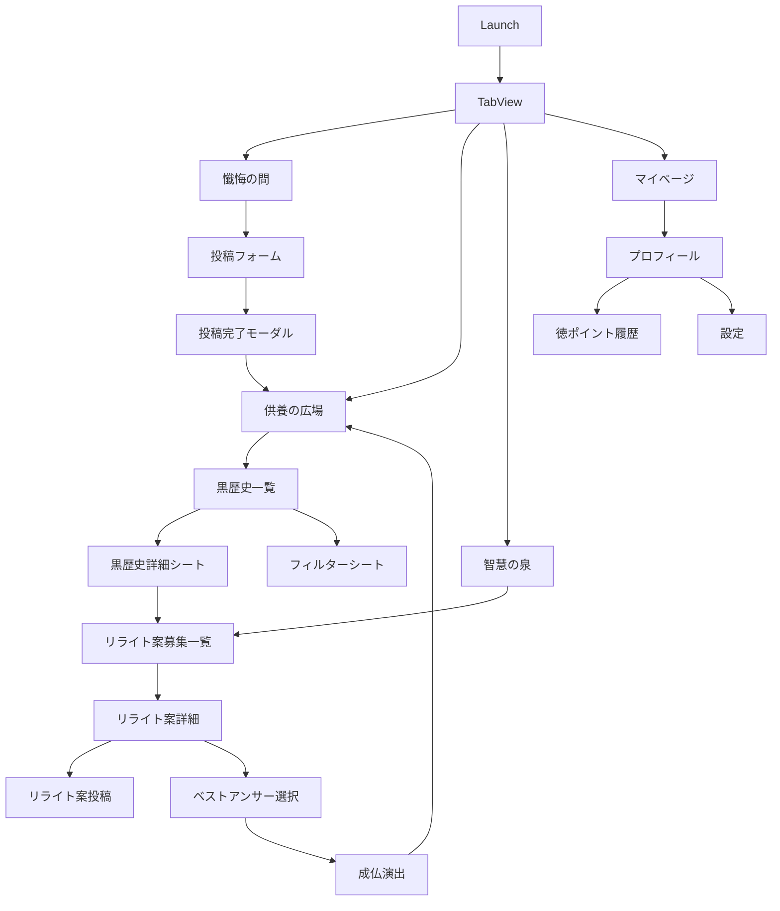

# 画面遷移図 - KUYOU

## 1. 画面一覧

### 1.1 メイン画面
1. **TabView** (ルート)
   - 懺悔の間 (Confession)
   - 供養の広場 (Timeline)
   - 智慧の泉 (Wisdom)
   - マイページ (Profile)

### 1.2 各タブの画面構成

#### 懺悔の間 (Confession)
- ConfessionView: 投稿フォーム画面
- ConfessionSuccessView: 投稿完了画面（モーダル）

#### 供養の広場 (Timeline)
- TimelineView: 黒歴史一覧画面
- BlackHistoryDetailView: 黒歴史詳細画面（シート）
- FilterView: フィルター設定画面（シート）

#### 智慧の泉 (Wisdom)
- WisdomListView: リライト案募集中の黒歴史一覧
- WisdomDetailView: リライト案投稿・閲覧画面
- JobutsuCelebrationView: 成仏演出画面（フルスクリーンカバー）

#### マイページ (Profile)
- ProfileView: プロフィール画面
- MeritPointHistoryView: 徳ポイント履歴（ナビゲーション）
- SettingsView: 設定画面（ナビゲーション）

## 2. 画面遷移フロー



## 3. 画面遷移詳細

### 3.1 初回起動フロー
```
1. アプリ起動
2. TabView表示（デフォルト: 供養の広場）
3. 初回利用の場合、簡単なオンボーディング（Optional）
```

### 3.2 投稿フロー
```
1. 「懺悔の間」タブをタップ
2. 黒歴史を入力
3. カテゴリを選択
4. 感情タグを選択（複数可）
5. 「懺悔する」ボタンをタップ
6. 投稿完了モーダル表示
7. 「供養の広場で見る」ボタンで Timeline へ遷移
```

### 3.3 供養フロー
```
1. 「供養の広場」で黒歴史カードを表示
2. 木魚アイコンをタップ
3. 供養エフェクト（波紋）表示
4. 供養数がインクリメント
5. 効果音「ポクポク」再生
```

### 3.4 リライトフロー
```
1. 黒歴史詳細から「智慧を授ける」ボタン
2. または「智慧の泉」タブから選択
3. リライト案を入力
4. ルート選択（爆笑/感動/真理）
5. 投稿
```

### 3.5 成仏フロー
```
1. 投稿者が「智慧の泉」でリライト案を確認
2. ベストアンサーを選択
3. 成仏確認ダイアログ
4. 成仏演出（フルスクリーン）
5. 供養の広場へ戻る（成仏済みマーク付き）
```

## 4. ナビゲーション実装

### 4.1 TabView 構造
```swift
TabView {
    ConfessionView()
        .tabItem {
            Label("懺悔の間", systemImage: "pencil.circle")
        }
    
    TimelineView()
        .tabItem {
            Label("供養の広場", systemImage: "list.bullet")
        }
    
    WisdomView()
        .tabItem {
            Label("智慧の泉", systemImage: "lightbulb")
        }
    
    ProfileView()
        .tabItem {
            Label("マイページ", systemImage: "person.circle")
        }
}
```

### 4.2 モーダル表示
- `.sheet()`: 黒歴史詳細、フィルター設定
- `.fullScreenCover()`: 成仏演出
- `.alert()`: 確認ダイアログ

### 4.3 NavigationStack
- マイページ内の画面遷移で使用
- 設定画面、履歴画面への遷移

## 5. 状態管理と画面遷移

### 5.1 画面間のデータ受け渡し
- `@EnvironmentObject`: DataStore（グローバル状態）
- `@Binding`: 親子間の状態共有
- Navigation Parameter: ID による詳細画面表示

### 5.2 Deep Link 対応（将来）
```
kuyou://timeline/{blackHistoryId}
kuyou://wisdom/{blackHistoryId}
kuyou://profile
```

## 6. UI/UX 考慮事項

### 6.1 トランジション
- タブ切り替え: デフォルトアニメーション
- モーダル表示: スライドアップ
- 成仏演出: フェードイン＋拡大

### 6.2 戻る操作
- タブ内では基本的に単一画面
- モーダルは下スワイプまたは×ボタンで閉じる
- 成仏演出後は自動的に Timeline へ

### 6.3 エラー時の遷移
- 投稿失敗: アラート表示、画面遷移なし
- 読み込み失敗: リトライボタン表示

## 7. 実装上の注意点

1. **画面遷移の一貫性**
   - 同じ種類の遷移には同じ方法を使用
   - ユーザーの期待に沿った動作

2. **パフォーマンス**
   - 重い処理は遷移前に開始
   - プログレス表示でフィードバック

3. **状態の保持**
   - タブ切り替え時も各画面の状態を保持
   - @StateObject で ViewModel を管理